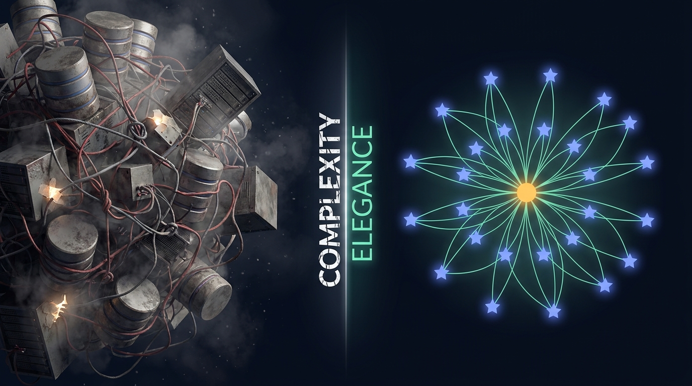
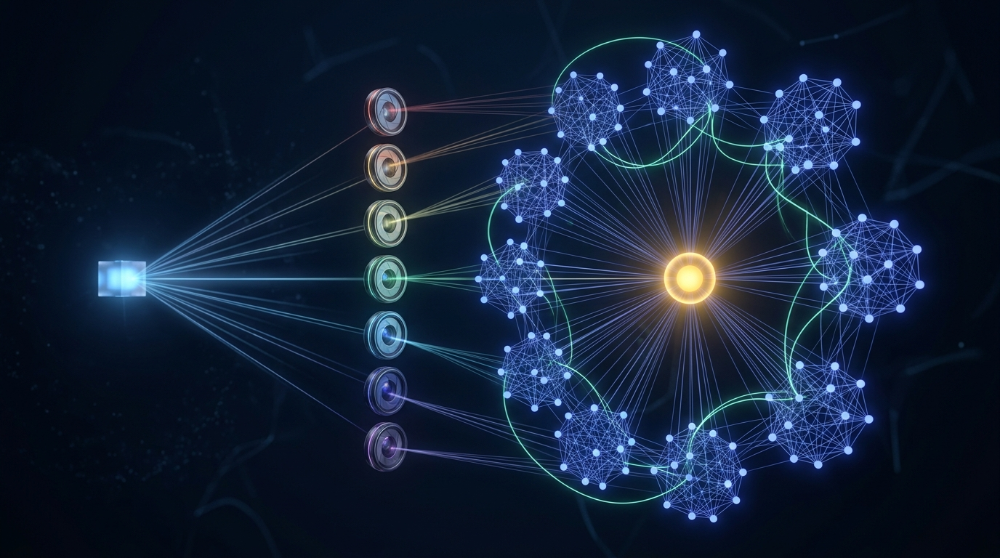
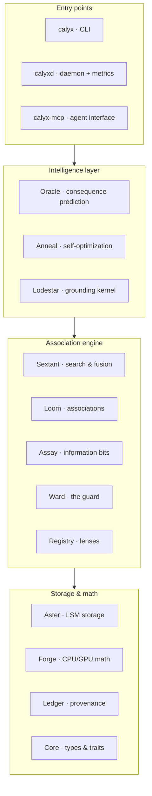
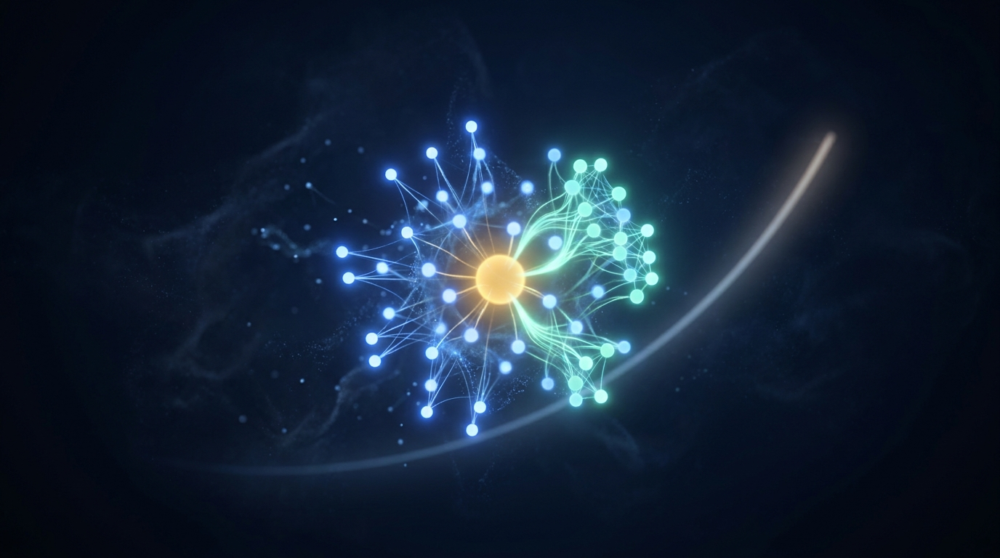
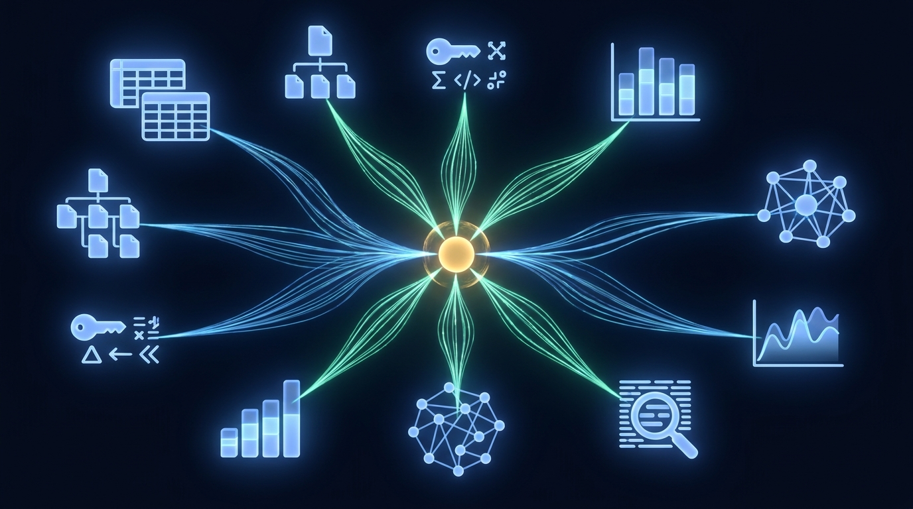

<div align="center">


# Calyx

### Store meaning, not tokens.

**Calyx is an association-native database.** Instead of storing rows and matching them, or storing one vector and finding its neighbors, Calyx stores *constellations* — one input measured through many frozen lenses — then fuses, grounds, and guards every answer. Built in Rust, with GPU linear algebra baked in.

[](LICENSE)
[](https://www.rust-lang.org)
[](#-project-status)
[](#-architecture)

[Why Calyx](#-why-calyx) · [Concepts](#-the-core-idea-constellations) · [Quick Start](#-quick-start) · [Architecture](#-architecture) · [Developer Docs](#-developer-documentation) · [Roadmap](#-project-status)


</div>

---

> **Calyx** is a database whose native record is the *association-constellation*: one input measured through many frozen embedders ("lenses"), fused, differentiated by the information each one adds, and anchored to real outcomes. It finds the small grounding **kernel** that explains a whole dataset, **guards** generated content against drift and out-of-distribution answers, keeps a tamper-evident **ledger** of how every answer was produced, and gets faster the more you use it.

A *calyx* is the whorl of sepals that holds a flower together at its base — the grounded structure from which a constellation of petals opens. That is exactly what this database is: a grounded base (kernel + provenance) that holds a constellation of vectors and lets it bloom into search, naming, and answers.

---

## ✨ Why Calyx

Every time you build a serious retrieval or intelligence system, you end up gluing the same machinery together by hand: a vector store for semantics, a keyword index for lexical match, a graph database for relationships, a pile of bespoke code to combine embedders, more code to measure whether a new embedder actually helps, and *still* nothing that tells you when your AI's answer has wandered outside what your data can support.

Calyx bakes that machinery **once, into the storage engine**.

<div align="center">

</div>

| What a multi-signal system needs | Vector DB / pgvector / Elastic / Neo4j | **Calyx bakes in** |
|---|---|---|
| Many embedders, each versioned & frozen | You build the lifecycle yourself | **Registry** — add/retire lenses; each is content-addressed and immutable |
| Combine signals into one ranking | Hand-tuned fusion across systems | **Sextant** — dense + sparse + multi-vector fusion in one query |
| Know which signals actually *help* | You measure mutual information by hand | **Assay** — measures the bits each lens adds; prunes redundant ones |
| Relationships between records | A separate graph database | **Loom** + **Lodestar** — associations are native; the explanatory *kernel* is discoverable |
| Stop the AI from answering off-distribution | Nothing | **Ward** — a calibrated, fail-closed guard on every answer |
| Prove how an answer was produced | Metadata columns, best effort | **Ledger** — hash-chained, tamper-evident provenance |
| Get faster with use | Manual index / quantization tuning | **Anneal** — safe, reversible self-optimization |

> [!NOTE]
> A vector database is a **one-lens Calyx**: a single embedder plus nearest-neighbor search. Calyx is built for the case where one signal is never enough.

---

## 🌟 The core idea: constellations

A traditional database stores a **row**. A vector database stores a **point**. Calyx stores a **constellation**: one input, measured through many independent *lenses* (embedders and feature extractors), each producing its own typed slot-vector — kept **separate**, never flattened into one opaque blob.

<div align="center">

</div>

Calyx is organized around four verbs — the calculus of association:

| Verb | What it means | Subsystem |
|---|---|---|
| **Measure** | Assemble a constellation by viewing one input through every lens in a panel | Registry, Aster |
| **Count** | Derive the associations *between* slots (agreement, delta, interaction) | Loom |
| **Differentiate** | Quantify the unique information each lens contributes about real outcomes | Assay |
| **Compose** | Find the explanatory kernel, guard generation, and answer with provenance | Lodestar, Ward, Ledger |

Three principles make the results trustworthy:

- **Grounding is mandatory.** Every claim is measured against real, anchored outcomes. Ungrounded results are explicitly tagged *provisional* rather than presented as fact.
- **Keep slots separate (no-flatten).** Signals stay typed and independent end-to-end, so you can always see *which* lens drove a result.
- **Fail closed.** Unknown lens, shape mismatch, uncalibrated guard, missing data → a structured error, never a silent wrong answer.

---

## 🚀 Quick Start

> [!IMPORTANT]
> Calyx is a Rust workspace (`edition 2024`, toolchain `1.95`). It builds CPU-only by default; the GPU backend is an opt-in feature.

**Prerequisites**

- Rust `1.95` (via [`rustup`](https://rustup.rs); the pinned toolchain is in `rust-toolchain.toml`)
- A C toolchain (for bundled SQLite, used by the migration tool)
- *Optional, for GPU acceleration:* an NVIDIA `sm_120`-class GPU and CUDA `13.2`

**Build & test**

```bash
git clone https://github.com/ChrisRoyse/Calyx.git
cd Calyx

# CPU build (portable, uses SIMD math)
cargo build --release --workspace

# Run the test suite
cargo test --workspace

# Optional: build with the CUDA backend
cargo build --release --workspace --features cuda
```

**Try the CLI**

The `calyx` binary is the operator surface. A few read-only examples:

```bash
# Verify your toolchain & environment are ready
cargo run -p calyx-cli -- healthcheck

# Inspect a vault's column families, manifest, or ledger
cargo run -p calyx-cli -- readback manifest --vault ./my-vault
cargo run -p calyx-cli -- readback cf --vault ./my-vault

# Verify the provenance ledger's hash chain end-to-end
cargo run -p calyx-cli -- verify-chain --vault ./my-vault

# Migrate an existing SQLite database into a Calyx vault
cargo run -p calyx-cli -- migrate --from ./app.db --to ./my-vault
```

See the [CLI reference](#cli-the-calyx-binary) for the full command surface.

---

## 🧭 Architecture

Calyx is **not** a service mesh. It is an embedded engine — a stack of focused Rust crates — with three thin entry points on top: a CLI (`calyx`), a daemon (`calyxd`), and an MCP server (`calyx-mcp`).

Every subsystem is named for an instrument of celestial navigation: a lens is a sighting instrument, the kernel is the guiding star, and search is navigation.



| Subsystem | Crate | What it is |
|---|---|---|
| 🪐 **Aster** | `calyx-aster` | Embedded LSM storage: write-ahead log, group-commit, MVCC snapshots, memory-mapped tables, crash recovery, hot/cold tiering. The "schema" layer. |
| 🔥 **Forge** | `calyx-forge` | The numeric runtime: one math backend implemented twice — CPU SIMD and CUDA — engineered for bit-near parity. Quantization from full precision down to 1-bit. |
| 🔭 **Registry** | `calyx-registry` | The lens registry: seven embedder runtimes (local, server, ONNX, algorithmic, multimodal…), each frozen and content-addressed. Hot-swap and lazy backfill. |
| 🧭 **Sextant** | `calyx-sextant` | Search & navigation: in-RAM and on-disk vector indexes, keyword (BM25) index, late-interaction, and multi-signal fusion with a query planner. |
| 🕸️ **Loom** | `calyx-loom` | Derives the associations *between* slots (agreement, delta, interaction) and weaves them into a queryable association graph. |
| ⚖️ **Assay** | `calyx-assay` | Measures the information (in bits) each lens contributes about real outcomes, enforces a redundancy contract, and reports panel sufficiency. |
| ⭐ **Lodestar** | `calyx-lodestar` | Discovers the small **grounding kernel** that explains a corpus, and turns it into both an index and an answer path. |
| 🛡️ **Ward** | `calyx-ward` | The fail-closed guard: scores every required slot independently against a calibrated threshold and refuses out-of-distribution or ungrounded content. |
| 📜 **Ledger** | `calyx-ledger` | Append-only, hash-chained provenance with periodic signed checkpoints and tamper-evident verification. |
| ♨️ **Anneal** | `calyx-anneal` | Reversible self-optimization: tunes the engine within safety tripwires and rolls back anything that regresses quality. |
| 🔮 **Oracle** | `calyx-oracle` | Consequence prediction over grounded constellations, with an honesty gate that refuses to answer when the data can't support it. |
| 🧩 **Core** | `calyx-core` | The dependency-free foundation: identifiers, the closed error catalog, the data model, and the engine traits everything else implements. |

---

## 🧠 The intelligence layer

What makes Calyx more than a fast multi-index search engine is the layer that turns retrieval into *grounded* intelligence.

### ⭐ Lodestar — the grounding kernel

Most datasets are mostly redundant. Lodestar discovers the small set of records — the **kernel** — that actually carries the structure of the whole corpus, scoring candidates by how central and how *grounded* they are. The kernel then doubles as a fast index and as an answer path: route a query through the kernel first, then walk its edges to an answer.

### 🛡️ Ward — the no-hallucination guard

<div align="center">

</div>

Ward is a **fail-closed boundary** around what your data can support. Each required slot is scored *independently* against a calibrated threshold — there is no single averaged gate that a strong score on one slot can sneak past. Anything outside the trusted region is refused, quarantined, or recorded as a new region to learn — never waved through. Thresholds are set by conformal calibration to a target false-accept rate, so the guard's strictness is a number you choose, not a guess.

### 📜 Ledger — provenance you can verify

<div align="center">

</div>

Every measurement, kernel, guard verdict, and answer is appended to a hash-chained ledger. Each entry seals the one before it, so any tampering is detectable; periodic checkpoints can be cryptographically signed; and a single command can re-verify the entire chain. You can always answer the question *"how was this produced, and has anything changed since?"*

### ♨️ Anneal — a database that improves with use

<div align="center">

</div>

Anneal continuously tunes the engine — index parameters, quantization levels, fusion weights — but **safely**: every change is gated against quality tripwires and shadow-tested before it goes live, and anything that regresses recall, latency, or guard accuracy is automatically reverted. Optimization that can only make things better, and is always reversible.

### 🔮 Oracle — grounded consequence prediction

<div align="center">

</div>

Oracle predicts the grounded consequences of an action by mining recurrence patterns in your data, builds a branching "butterfly" tree of likely downstream effects, and can even walk backward from an outcome to its likely causes. Crucially, it has an **honesty gate**: when the available signals can't support a confident prediction, Oracle returns *insufficient* with the specific deficits — instead of fabricating an answer.

---

## 🗄️ One core, every paradigm

<div align="center">

</div>

Because everything is built on one ordered, transactional storage core, Calyx can serve the role of many database shapes at once:

| Paradigm | How Calyx serves it |
|---|---|
| **Vector** | A dense lens + per-slot ANN search — a vector DB is a one-lens Calyx |
| **Full-text** | A sparse lexical lens with a BM25 inverted index |
| **Graph** | Associations are native; cross-terms are edges and the kernel is a path |
| **Time-series** | Range keys + temporal lenses, with time scoring that is *additive and never dominant* |
| **Key-value / Document / Relational** | Typed records and keyed state on the same transactional core |

The search-shaped paradigms collapse into the association engine; the storage-shaped ones are the general data layer beneath it. One engine, one transaction, one source of truth.

---

## 📚 Developer Documentation

Everything a developer needs to build with Calyx. Deep, source-derived references live in [`docs/systemspecs/`](docs/systemspecs/) (start at [`01_system_overview.md`](docs/systemspecs/01_system_overview.md)).

### Building from source

| Step | Command |
|---|---|
| Install the pinned toolchain | `rustup show` (reads `rust-toolchain.toml`) |
| CPU build | `cargo build --release --workspace` |
| GPU build (CUDA `sm_120`) | `cargo build --release --workspace --features cuda` |
| Run tests | `cargo test --workspace` |
| Format & lint | `cargo fmt` · `cargo clippy` |

> [!NOTE]
> The CPU backend uses portable SIMD and runs anywhere. The CUDA backend is gated behind the `cuda` feature and is verified for bit-near parity against the CPU backend (relative tolerance `1e-3`, absolute `1e-6`).

### Binaries

| Binary | Crate | Role |
|---|---|---|
| `calyx` | `calyx-cli` | Operator CLI: readback, migration, navigation, verification |
| `calyxd` | `calyxd` | Loopback daemon: Prometheus `/metrics`, ledger verification loop, VRAM preflight, healthcheck |
| `calyx-mcp` | `calyx-mcp` | JSON-RPC 2.0 [Model Context Protocol](https://modelcontextprotocol.io) server over stdio, for AI-agent integration |

### Configuration

`calyxd` is configured from a single TOML file (passed via `--config`) and validated **fail-closed** — any unknown key is rejected rather than ignored.

```toml
# calyx.toml
bind_addr = "127.0.0.1:7700"     # must be a loopback address
vault_path = "$CALYX_HOME/data/vault"
vram_budget_mib = 8192           # 1..=30000
log_dir = "/var/log/calyx"
healthcheck_timeout_secs = 30
```

```bash
# Validate a config before starting
cargo run -p calyxd -- --config ./calyx.toml --validate-config
```

Selected environment variables the engine reads (all invalid values fail closed):

| Variable | Default | Purpose |
|---|---|---|
| `CALYX_HOME` | — | Root used to resolve `$CALYX_HOME` in paths and derive cache/tier roots |
| `CALYX_FORGE_VRAM_BUDGET` | `12 GiB` | VRAM soft cap for the Forge math runtime (bytes) |
| `CALYX_CAPABILITY_MIN_SIGNAL_BITS` | `0.05` | Minimum information a new lens must add to be admitted |
| `CALYX_CAPABILITY_MAX_PAIRWISE_CORR` | `0.6` | Maximum correlation a new lens may have with existing lenses |
| `HF_HOME` | `$CALYX_HOME/.hf-cache` | Cache directory for downloaded model weights |

### Data model

| Concept | Meaning |
|---|---|
| **Vault** | A Calyx database — a directory on disk |
| **Constellation** | One record: one input measured through a panel of lenses (never called a "row" or "point") |
| **Slot** | One typed vector within a constellation, produced by one lens |
| **Lens** | A frozen, content-addressed embedder or feature extractor (never just a "model") |
| **Panel** | A named set of lenses applied together |
| **Anchor** | A real outcome a constellation is grounded against |
| **Kernel** | The small set of constellations that explains a corpus |
| **Signal** | The information (in bits) a lens carries about an outcome |

### Storage tiers

| Tier | What lives here | Survives restart? |
|---|---|---|
| **Durable (source of truth)** | Write-ahead log, on-disk tables, manifest, the hash-chained ledger | Yes — recovered by replaying the log after loading the manifest |
| **Derived (regenerable)** | Secondary indexes, vector indexes, association cross-terms, kernel caches | Rebuildable from the durable tier |
| **Ephemeral** | Memtables, reader snapshots, in-RAM caches | No |

### Engine traits

The whole engine is composed from a few traits defined in `calyx-core`, so each layer can be extended independently:

| Trait | Responsibility |
|---|---|
| `Lens` | Turn an input into a typed slot-vector (an embedder/extractor) |
| `Index` / `SextantIndex` | Index and search vectors for one slot |
| `VaultStore` | Persist and read constellations and column families |
| `Estimator` | Measure information / mutual information between signals |
| `Backend` | Low-level math (GEMM, cosine, dot, top-k) — CPU or GPU |

### CLI: the `calyx` binary

Invoked as `calyx <command> [subcommand] [flags]`. Most commands emit JSON to stdout. Major command groups:

| Group | What it does |
|---|---|
| `readback` | Read-only inspection of vault internals — column families, log records, manifest, temporal/recurrence state |
| `migrate` | Import a SQLite database into a Calyx vault, with round-trip verification |
| `verify-chain` · `merkle` · `provenance` | Verify the ledger hash chain, checkpoints, and lineage |
| `navigate` · `sextant` · `lodestar` | Search, neighbor, consensus, traversal, and kernel exploration |
| `lens` · `panel` | Inspect and manage lenses and panels |
| `summarize` | Corpus and document summarization |
| `healthcheck` | Confirm toolchain, environment, and (optionally) a running daemon are ready |

### Error model

Calyx defines a single, closed catalog of stable `CALYX_*` error codes in `calyx-core`, each with a fixed meaning and remediation. The pervasive discipline is **fail-closed**: invalid input, a missing lens contract, an uncalibrated guard, or a failed GPU preflight all abort with a typed error rather than degrading silently into a wrong answer.

---

## 🗺️ Project status

> [!WARNING]
> **Calyx is pre-1.0 software under active development.** The on-disk format and public interfaces may change before a stable release.

The core engine — storage, math, the lens registry, multi-signal search, the association and information layers, the grounding kernel, the guard, the ledger, self-optimization, and the first oracle capabilities — is built and exercised by an extensive test suite.

Actively expanding toward 1.0:

- **A richer public CLI and a populated MCP toolset** so agents can drive the full engine directly.
- **Scale-out vector indexing** (on-disk graph and centroid-partitioned indexes) for very large vaults.
- **Server & deployment polish** for running `calyxd` as a managed service.
- **Broader validation** of the oracle and guard against public benchmark corpora.

> [!NOTE]
> Calyx's vision extends to a *grounded substrate for general intelligence* — measuring whether a domain has the signal to be predicted at all, and refusing to pretend when it doesn't. That north star is aspirational; the honesty gate that underpins it is already built.

---

## 🤝 Contributing

Contributions are welcome. A good change comes with a test that **fails when the behavior is wrong and passes when it is right** — see [`CONTRIBUTING.md`](CONTRIBUTING.md) for the testing philosophy and conventions.

A few house rules:

- Seed RNGs and inject the `Clock` — logic must never read wall-clock time or depend on locale.
- Keep the controlled vocabulary: a frozen embedder is a **lens**, a record is a **constellation**, information-about-outcome is **signal**.
- Run `cargo fmt`, `cargo clippy`, and `cargo test --workspace` before opening a PR.

---

## 📄 License

Calyx is **source-available** under the [Business Source License 1.1](LICENSE) (BSL) — the same model used by databases like CockroachDB, MariaDB, and Couchbase.

| Use | Allowed under BSL? |
|---|---|
| Development, testing, evaluation, research, education | ✅ Free |
| Personal & non-commercial projects | ✅ Free |
| Reading, modifying, and redistributing the source | ✅ Free |
| **Production or commercial use** — embedding in a product/service, or running in a business | 💼 Requires a commercial license |

Each released version automatically converts to the open-source **Apache License 2.0** four years after its release. For a commercial license, please [open an issue](https://github.com/ChrisRoyse/Calyx/issues). See [`LICENSE`](LICENSE) for the binding terms.

---

<div align="center">

**Calyx** — *Intelligence is the calculus of association. Calyx is its engine.*

<sub>Built in Rust 🦀 · GPU math baked in · Grounded by design</sub>

</div>
